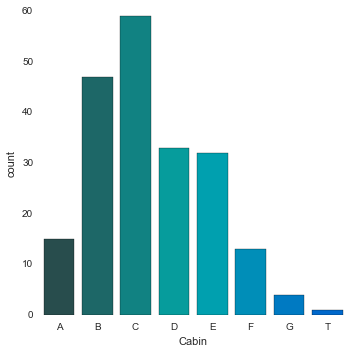
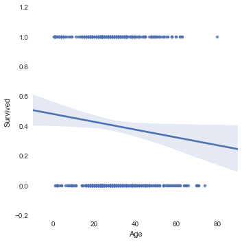

    import pandas as pd
    from pandas import Series, DataFrame

    titanic_df = pd.read_csv('titanic.csv')

    titanic_df.head()

<table border="1" class="dataframe">
  <thead>
    <tr style="text-align: right;">
      <th></th>
      <th>PassengerId</th>
      <th>Survived</th>
      <th>Pclass</th>
      <th>Name</th>
      <th>Sex</th>
      <th>Age</th>
      <th>SibSp</th>
      <th>Parch</th>
      <th>Ticket</th>
      <th>Fare</th>
      <th>Cabin</th>
      <th>Embarked</th>
    </tr>
  </thead>
  <tbody>
    <tr>
      <th>0</th>
      <td> 1</td>
      <td> 0</td>
      <td> 3</td>
      <td>                           Braund, Mr. Owen Harris</td>
      <td>   male</td>
      <td> 22</td>
      <td> 1</td>
      <td> 0</td>
      <td>        A/5 21171</td>
      <td>  7.2500</td>
      <td>  NaN</td>
      <td> S</td>
    </tr>
    <tr>
      <th>1</th>
      <td> 2</td>
      <td> 1</td>
      <td> 1</td>
      <td> Cumings, Mrs. John Bradley (Florence Briggs Th...</td>
      <td> female</td>
      <td> 38</td>
      <td> 1</td>
      <td> 0</td>
      <td>         PC 17599</td>
      <td> 71.2833</td>
      <td>  C85</td>
      <td> C</td>
    </tr>
    <tr>
      <th>2</th>
      <td> 3</td>
      <td> 1</td>
      <td> 3</td>
      <td>                            Heikkinen, Miss. Laina</td>
      <td> female</td>
      <td> 26</td>
      <td> 0</td>
      <td> 0</td>
      <td> STON/O2. 3101282</td>
      <td>  7.9250</td>
      <td>  NaN</td>
      <td> S</td>
    </tr>
    <tr>
      <th>3</th>
      <td> 4</td>
      <td> 1</td>
      <td> 1</td>
      <td>      Futrelle, Mrs. Jacques Heath (Lily May Peel)</td>
      <td> female</td>
      <td> 35</td>
      <td> 1</td>
      <td> 0</td>
      <td>           113803</td>
      <td> 53.1000</td>
      <td> C123</td>
      <td> S</td>
    </tr>
    <tr>
      <th>4</th>
      <td> 5</td>
      <td> 0</td>
      <td> 3</td>
      <td>                          Allen, Mr. William Henry</td>
      <td>   male</td>
      <td> 35</td>
      <td> 0</td>
      <td> 0</td>
      <td>           373450</td>
      <td>  8.0500</td>
      <td>  NaN</td>
      <td> S</td>
    </tr>
  </tbody>
</table>

    titanic_df.info()

    <class 'pandas.core.frame.DataFrame'>
    Int64Index: 891 entries, 0 to 890
    Data columns (total 12 columns):
    PassengerId    891 non-null int64
    Survived       891 non-null int64
    Pclass         891 non-null int64
    Name           891 non-null object
    Sex            891 non-null object
    Age            714 non-null float64
    SibSp          891 non-null int64
    Parch          891 non-null int64
    Ticket         891 non-null object
    Fare           891 non-null float64
    Cabin          204 non-null object
    Embarked       889 non-null object
    dtypes: float64(2), int64(5), object(5)
    memory usage: 90.5+ KB

    #QUESTIONS TO ANSWER FROM TITANIC DATASET
    #1. Who where the passengers on the titanic?

    import numpy as np
    import matplotlib.pyplot as plt
    import seaborn as sns
    %matplotlib inline

    sns.factorplot('Sex', data = titanic_df)

    <seaborn.axisgrid.FacetGrid at 0x1042a9d90>

    sns.factorplot('Sex',data=titanic_df,hue='Pclass')

    <seaborn.axisgrid.FacetGrid at 0x1042a9f50>

    sns.factorplot('Pclass',data=titanic_df,hue='Sex')

    <seaborn.axisgrid.FacetGrid at 0x106bc4b10>

    def male_female_child(passenger):
        age, sex = passenger
        
        if age < 16:
            return 'child'
        else:
            return sex

    titanic_df['Person'] = titanic_df[['Age','Sex']].apply(male_female_child, axis=1)

    titanic_df[0:10]

<table border="1" class="dataframe">
  <thead>
    <tr style="text-align: right;">
      <th></th>
      <th>PassengerId</th>
      <th>Survived</th>
      <th>Pclass</th>
      <th>Name</th>
      <th>Sex</th>
      <th>Age</th>
      <th>SibSp</th>
      <th>Parch</th>
      <th>Ticket</th>
      <th>Fare</th>
      <th>Cabin</th>
      <th>Embarked</th>
      <th>person</th>
      <th>Person</th>
    </tr>
  </thead>
  <tbody>
    <tr>
      <th>0</th>
      <td>  1</td>
      <td> 0</td>
      <td> 3</td>
      <td>                           Braund, Mr. Owen Harris</td>
      <td>   male</td>
      <td> 22</td>
      <td> 1</td>
      <td> 0</td>
      <td>        A/5 21171</td>
      <td>  7.2500</td>
      <td>  NaN</td>
      <td> S</td>
      <td>   male</td>
      <td>   male</td>
    </tr>
    <tr>
      <th>1</th>
      <td>  2</td>
      <td> 1</td>
      <td> 1</td>
      <td> Cumings, Mrs. John Bradley (Florence Briggs Th...</td>
      <td> female</td>
      <td> 38</td>
      <td> 1</td>
      <td> 0</td>
      <td>         PC 17599</td>
      <td> 71.2833</td>
      <td>  C85</td>
      <td> C</td>
      <td> female</td>
      <td> female</td>
    </tr>
    <tr>
      <th>2</th>
      <td>  3</td>
      <td> 1</td>
      <td> 3</td>
      <td>                            Heikkinen, Miss. Laina</td>
      <td> female</td>
      <td> 26</td>
      <td> 0</td>
      <td> 0</td>
      <td> STON/O2. 3101282</td>
      <td>  7.9250</td>
      <td>  NaN</td>
      <td> S</td>
      <td> female</td>
      <td> female</td>
    </tr>
    <tr>
      <th>3</th>
      <td>  4</td>
      <td> 1</td>
      <td> 1</td>
      <td>      Futrelle, Mrs. Jacques Heath (Lily May Peel)</td>
      <td> female</td>
      <td> 35</td>
      <td> 1</td>
      <td> 0</td>
      <td>           113803</td>
      <td> 53.1000</td>
      <td> C123</td>
      <td> S</td>
      <td> female</td>
      <td> female</td>
    </tr>
    <tr>
      <th>4</th>
      <td>  5</td>
      <td> 0</td>
      <td> 3</td>
      <td>                          Allen, Mr. William Henry</td>
      <td>   male</td>
      <td> 35</td>
      <td> 0</td>
      <td> 0</td>
      <td>           373450</td>
      <td>  8.0500</td>
      <td>  NaN</td>
      <td> S</td>
      <td>   male</td>
      <td>   male</td>
    </tr>
    <tr>
      <th>5</th>
      <td>  6</td>
      <td> 0</td>
      <td> 3</td>
      <td>                                  Moran, Mr. James</td>
      <td>   male</td>
      <td>NaN</td>
      <td> 0</td>
      <td> 0</td>
      <td>           330877</td>
      <td>  8.4583</td>
      <td>  NaN</td>
      <td> Q</td>
      <td>   male</td>
      <td>   male</td>
    </tr>
    <tr>
      <th>6</th>
      <td>  7</td>
      <td> 0</td>
      <td> 1</td>
      <td>                           McCarthy, Mr. Timothy J</td>
      <td>   male</td>
      <td> 54</td>
      <td> 0</td>
      <td> 0</td>
      <td>            17463</td>
      <td> 51.8625</td>
      <td>  E46</td>
      <td> S</td>
      <td>   male</td>
      <td>   male</td>
    </tr>
    <tr>
      <th>7</th>
      <td>  8</td>
      <td> 0</td>
      <td> 3</td>
      <td>                    Palsson, Master. Gosta Leonard</td>
      <td>   male</td>
      <td>  2</td>
      <td> 3</td>
      <td> 1</td>
      <td>           349909</td>
      <td> 21.0750</td>
      <td>  NaN</td>
      <td> S</td>
      <td>  child</td>
      <td>  child</td>
    </tr>
    <tr>
      <th>8</th>
      <td>  9</td>
      <td> 1</td>
      <td> 3</td>
      <td> Johnson, Mrs. Oscar W (Elisabeth Vilhelmina Berg)</td>
      <td> female</td>
      <td> 27</td>
      <td> 0</td>
      <td> 2</td>
      <td>           347742</td>
      <td> 11.1333</td>
      <td>  NaN</td>
      <td> S</td>
      <td> female</td>
      <td> female</td>
    </tr>
    <tr>
      <th>9</th>
      <td> 10</td>
      <td> 1</td>
      <td> 2</td>
      <td>               Nasser, Mrs. Nicholas (Adele Achem)</td>
      <td> female</td>
      <td> 14</td>
      <td> 1</td>
      <td> 0</td>
      <td>           237736</td>
      <td> 30.0708</td>
      <td>  NaN</td>
      <td> C</td>
      <td>  child</td>
      <td>  child</td>
    </tr>
  </tbody>
</table>

    sns.factorplot('Pclass',data=titanic_df,hue='Person')

    <seaborn.axisgrid.FacetGrid at 0x10a635a90>

    titanic_df['Age'].hist(bins=70)

    <matplotlib.axes._subplots.AxesSubplot at 0x10aca5910>

    titanic_df['Person'].value_counts()

    male      537
    female    271
    child      83
    dtype: int64

    fig = sns.FacetGrid(titanic_df,hue='Sex',aspect=4)
    
    fig.map(sns.kdeplot,'Age',shade=True)
    
    oldest = titanic_df['Age'].max()
    
    fig.set(xlim=(0,oldest))
    
    fig.add_legend()

    fig = sns.FacetGrid(titanic_df,hue='Person',aspect=4)
    
    fig.map(sns.kdeplot,'Age',shade=True)
    
    oldest = titanic_df['Age'].max()
    
    fig.set(xlim=(0,oldest))
    
    fig.add_legend()

    fig = sns.FacetGrid(titanic_df,hue='Pclass',aspect=4)
    
    fig.map(sns.kdeplot,'Age',shade=True)
    
    oldest = titanic_df['Age'].max()
    
    fig.set(xlim=(0,oldest))
    
    fig.add_legend()

    #2. What deck were the passengers on and how does it relate to their class?

    deck = titanic_df['Cabin'].dropna()

    levels = []
    
    for level in deck:
        levels.append(level[0])
    
    cabin_df = DataFrame(levels)
    
    cabin_df.columns = ['Cabin']
    
    sns.factorplot('Cabin',data=cabin_df,palette='winter_d')
        

    <seaborn.axisgrid.FacetGrid at 0x10a92cc50>

    cabin_df = cabin_df[cabin_df.Cabin != 'T']

    sns.factorplot('Cabin',data=cabin_df,palette='summer')

    <seaborn.axisgrid.FacetGrid at 0x10b19ed10>

    sns.factorplot('Embarked',data=titanic_df,hue='Pclass',x_order=['C','Q','S'])

    <seaborn.axisgrid.FacetGrid at 0x10b19e590>

    #3. Who was alone and who was with family?

    titanic_df['Alone'] = titanic_df.SibSp + titanic_df.Parch

    titanic_df.head()

<table border="1" class="dataframe">
  <thead>
    <tr style="text-align: right;">
      <th></th>
      <th>PassengerId</th>
      <th>Survived</th>
      <th>Pclass</th>
      <th>Name</th>
      <th>Sex</th>
      <th>Age</th>
      <th>SibSp</th>
      <th>Parch</th>
      <th>Ticket</th>
      <th>Fare</th>
      <th>Cabin</th>
      <th>Embarked</th>
      <th>person</th>
      <th>Person</th>
      <th>Alone</th>
    </tr>
  </thead>
  <tbody>
    <tr>
      <th>0</th>
      <td> 1</td>
      <td> 0</td>
      <td> 3</td>
      <td>                           Braund, Mr. Owen Harris</td>
      <td>   male</td>
      <td> 22</td>
      <td> 1</td>
      <td> 0</td>
      <td>        A/5 21171</td>
      <td>  7.2500</td>
      <td>  NaN</td>
      <td> S</td>
      <td>   male</td>
      <td>   male</td>
      <td> 1</td>
    </tr>
    <tr>
      <th>1</th>
      <td> 2</td>
      <td> 1</td>
      <td> 1</td>
      <td> Cumings, Mrs. John Bradley (Florence Briggs Th...</td>
      <td> female</td>
      <td> 38</td>
      <td> 1</td>
      <td> 0</td>
      <td>         PC 17599</td>
      <td> 71.2833</td>
      <td>  C85</td>
      <td> C</td>
      <td> female</td>
      <td> female</td>
      <td> 1</td>
    </tr>
    <tr>
      <th>2</th>
      <td> 3</td>
      <td> 1</td>
      <td> 3</td>
      <td>                            Heikkinen, Miss. Laina</td>
      <td> female</td>
      <td> 26</td>
      <td> 0</td>
      <td> 0</td>
      <td> STON/O2. 3101282</td>
      <td>  7.9250</td>
      <td>  NaN</td>
      <td> S</td>
      <td> female</td>
      <td> female</td>
      <td> 0</td>
    </tr>
    <tr>
      <th>3</th>
      <td> 4</td>
      <td> 1</td>
      <td> 1</td>
      <td>      Futrelle, Mrs. Jacques Heath (Lily May Peel)</td>
      <td> female</td>
      <td> 35</td>
      <td> 1</td>
      <td> 0</td>
      <td>           113803</td>
      <td> 53.1000</td>
      <td> C123</td>
      <td> S</td>
      <td> female</td>
      <td> female</td>
      <td> 1</td>
    </tr>
    <tr>
      <th>4</th>
      <td> 5</td>
      <td> 0</td>
      <td> 3</td>
      <td>                          Allen, Mr. William Henry</td>
      <td>   male</td>
      <td> 35</td>
      <td> 0</td>
      <td> 0</td>
      <td>           373450</td>
      <td>  8.0500</td>
      <td>  NaN</td>
      <td> S</td>
      <td>   male</td>
      <td>   male</td>
      <td> 0</td>
    </tr>
  </tbody>
</table>

    titanic_df['Alone'].loc[titanic_df['Alone'] > 0 ] = 'With Family'
    titanic_df['Alone'].loc[titanic_df['Alone'] == 0 ] = 'Alone'

    /Users/mauriciorey/anaconda/lib/python2.7/site-packages/pandas/core/indexing.py:121: SettingWithCopyWarning: 
    A value is trying to be set on a copy of a slice from a DataFrame
    
    See the the caveats in the documentation: http://pandas.pydata.org/pandas-docs/stable/indexing.html#indexing-view-versus-copy
      self._setitem_with_indexer(indexer, value)

    titanic_df.head()

<table border="1" class="dataframe">
  <thead>
    <tr style="text-align: right;">
      <th></th>
      <th>PassengerId</th>
      <th>Survived</th>
      <th>Pclass</th>
      <th>Name</th>
      <th>Sex</th>
      <th>Age</th>
      <th>SibSp</th>
      <th>Parch</th>
      <th>Ticket</th>
      <th>Fare</th>
      <th>Cabin</th>
      <th>Embarked</th>
      <th>person</th>
      <th>Person</th>
      <th>Alone</th>
    </tr>
  </thead>
  <tbody>
    <tr>
      <th>0</th>
      <td> 1</td>
      <td> 0</td>
      <td> 3</td>
      <td>                           Braund, Mr. Owen Harris</td>
      <td>   male</td>
      <td> 22</td>
      <td> 1</td>
      <td> 0</td>
      <td>        A/5 21171</td>
      <td>  7.2500</td>
      <td>  NaN</td>
      <td> S</td>
      <td>   male</td>
      <td>   male</td>
      <td> With Family</td>
    </tr>
    <tr>
      <th>1</th>
      <td> 2</td>
      <td> 1</td>
      <td> 1</td>
      <td> Cumings, Mrs. John Bradley (Florence Briggs Th...</td>
      <td> female</td>
      <td> 38</td>
      <td> 1</td>
      <td> 0</td>
      <td>         PC 17599</td>
      <td> 71.2833</td>
      <td>  C85</td>
      <td> C</td>
      <td> female</td>
      <td> female</td>
      <td> With Family</td>
    </tr>
    <tr>
      <th>2</th>
      <td> 3</td>
      <td> 1</td>
      <td> 3</td>
      <td>                            Heikkinen, Miss. Laina</td>
      <td> female</td>
      <td> 26</td>
      <td> 0</td>
      <td> 0</td>
      <td> STON/O2. 3101282</td>
      <td>  7.9250</td>
      <td>  NaN</td>
      <td> S</td>
      <td> female</td>
      <td> female</td>
      <td>       Alone</td>
    </tr>
    <tr>
      <th>3</th>
      <td> 4</td>
      <td> 1</td>
      <td> 1</td>
      <td>      Futrelle, Mrs. Jacques Heath (Lily May Peel)</td>
      <td> female</td>
      <td> 35</td>
      <td> 1</td>
      <td> 0</td>
      <td>           113803</td>
      <td> 53.1000</td>
      <td> C123</td>
      <td> S</td>
      <td> female</td>
      <td> female</td>
      <td> With Family</td>
    </tr>
    <tr>
      <th>4</th>
      <td> 5</td>
      <td> 0</td>
      <td> 3</td>
      <td>                          Allen, Mr. William Henry</td>
      <td>   male</td>
      <td> 35</td>
      <td> 0</td>
      <td> 0</td>
      <td>           373450</td>
      <td>  8.0500</td>
      <td>  NaN</td>
      <td> S</td>
      <td>   male</td>
      <td>   male</td>
      <td>       Alone</td>
    </tr>
  </tbody>
</table>

    sns.factorplot('Alone',data=titanic_df,palette='Blues')

    <seaborn.axisgrid.FacetGrid at 0x10bf939d0>

    #4. Who survived and who didn't

    titanic_df['Survivor'] = titanic_df.Survived.map({0:'no',1:'yes' })
    
    sns.factorplot('Survivor',data=titanic_df,palette='summer')

    <seaborn.axisgrid.FacetGrid at 0x10b16c550>

    sns.factorplot('Pclass','Survived',hue='Person',data=titanic_df)

    <seaborn.axisgrid.FacetGrid at 0x10b7a3410>

    sns.lmplot('Age','Survived',data=titanic_df)

    <seaborn.axisgrid.FacetGrid at 0x10d44c7d0>

    sns.lmplot('Age','Survived',hue='Pclass',data=titanic_df, palette='winter')

    <seaborn.axisgrid.FacetGrid at 0x10e0d0190>

    generations = [20, 40, 60, 80]

    sns.lmplot('Age','Survived',hue='Pclass',data=titanic_df, palette='winter',x_bins=generations)

    <seaborn.axisgrid.FacetGrid at 0x10d7b3390>

    sns.lmplot('Age','Survived',hue='Pclass',data=titanic_df)

    <seaborn.axisgrid.FacetGrid at 0x10f2bd890>

    
